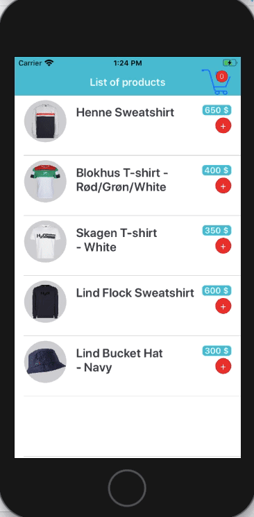

<h1>Swift Weather App(Jayway)</h1>

Allows the user to view the current products with products detail and then User can add products to shopping list. Also, User can remove product from shopping list.  
MVVM(Model-View-ModelView) architectural pattern was used.  
Crud(Create, Read, Update, Delete) operations is running on Core Data.  

<h2>Externally Used Library</h2>
Cocoa pods was installed but it wasn't used 

<h2>Screen Gif</h2>

